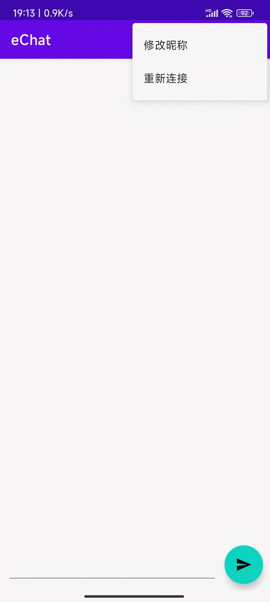

# eChat
> 微聊天app

## 实现功能
- 一个**极简**风格**互联网匿名**聊天室
- 可以看到同时在线人数
- 可以修改昵称
- 仅显示打开app后的聊天记录，不会保存聊天记录（app关闭后之前的聊天记录消失）
## 程序展示和说明
- 图标

- 打开程序后的界面为

中间靠上的数字表示同时在线人数

- 点击右上角的功能栏


其中程序在打开时会自动连接服务器，如果首次网络连接失败，可以在此重新连接

- 最下方的为输入框和发送信息按钮

- demo


## 实现基本逻辑
- 服务端部署在linux服务器，为Java程序，使用线程池接受TCP连接，并保存每一个客户端的输出流，在接收到任一客户端的信息后，对该信息进行广播，即对保存的所有输出流进行输出(除发送者外)
- 客户端连接指定服务器后进行通信
- app主界面嵌套recyclerview视图，显示发送的信息和昵称，recyclerview视图单元设置两种布局，一种为自己发送的信息布局，另外一种是其他人发送的信息布局

## 项目记录
- 成功部署在阿里云服务器上，通过配置安全组规则开放对外端口
- 使用Nginx框架提供下载apk的在线网站
- 服务器端运行命令（nohup使程序免受sighup信号影响，即session关闭；&使程序后台运行免受sigint信号影响；2>&1 重定向标准错误流至标准输出流；> log 将所有输出重定向至log文件）
```shell
nohup java -jar eChat.jar > log 2>&1 &
```
- 服务器端查找后台java程序命令（ps 显示当前控制台下属于用户的进程；-e 增加进程的输出信息；-f 显示在系统上运行的所有进程；grep 查找符合条件的字符串）
```shell
ps -ef | grep java
```
## 更新记录
| 版本号 | 说明                                                         |
| ------ | ------------------------------------------------------------ |
| 1.2    | 增加滚动条；优化主题颜色                                     |
| 1.1    | 添加聊天室同时在线人数；添加输入框提示信息；修改服务器端容器以支持并发操作；服务器端log记录加入IP和时间 |

